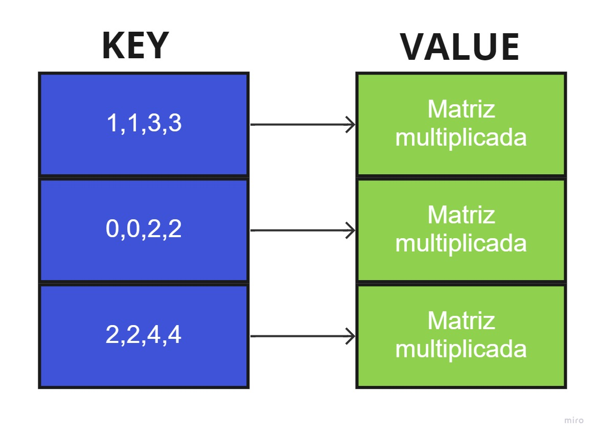
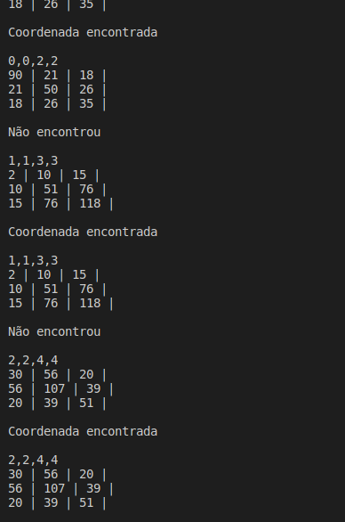

# Processamento de matrizes por segmentação de arquivo

## Sumário

<!--ts-->
   * [Problema Proposto](#problema-proposto)
   * [Novas funcionalidades aprendidas](#aprendizado)
      * [Map](#map)
   * [Lógica](#lógica)
      * [Leitura das coordenadas](#leitura-das-coordenadas)
      * [Leitura da matriz](#leitura-da-matriz)
      * [Operações com a Matriz](#operações-com-a-matriz)
      * [Hash](#hash)
   * [Resultados e Análises](#bibliotecas)
       * [🐛 Bugs](#bugs)
       * [Exemplos](#exemplos)
   * [Compilação e Execução](#compilação-e-execução)
   * [Contato](#contato)
<!--te-->

## Problema Proposto

 Implementar um sistema de multiplicação de matrizes baseando-se em uma estratégia de segmentação em arquivo. Um arquivo M grande é fornecido no formato NxN com valores de ponto flutuante ou inteiros como entrada. Este é processado a partir de várias coordenadas introduzidas por um segundo arquivo, o coordenadas.txt. Em coordenadas.txt deve ser descrito por linha uma dupla de i e j correspondendo a posição inicial e final a ser lida. Por exemplo, as posições 2,4,6,10 indica que a leitura em M deve iniciar na linha 2 coluna 4 e seguir até a linha 6 coluna 10. 

Feito a leitura da composição de M para um tipo matriz em C, a segunda etapa é produzir a transposta de M -= MT. Feito isso, produza a multiplicação e armazene em uma hash o resultado da multiplicação como valor para a dupla de i's e j's, os quais deverão ser utilizados como chaves da hash. Assim, para cada novo calculo, antes o sistema deve consular a hash para identificar se a multiplicação já foi realizada. Em caso afirmativo, retorne apenas a resposta já calculada. Caso contrário, elabore a multiplicação e armazene o conteúdo em cache. 

## Aprendizado

### Map

Os mapas são contêineres associativos que armazenam elementos formados por uma combinação de um valor de chave e um valor mapeado , seguindo uma ordem específica. Em um map , os valores de chave geralmente são usados para classificar e identificar exclusivamente os elementos, enquanto os valores mapeados armazenam o conteúdo associado a essa chave . Os tipos de chave e valor mapeado podem diferir e são agrupados no tipo de membro value_type , que é um tipo de par que combina ambos.
  

  
  

    
  Internamente, os elementos em um mapa são sempre ordenados por sua chave seguindo um critério de ordenação fraco estrito específico indicado por seu objeto de comparação interno (do tipo Compare ).
  
  Os contêineres de mapa geralmente são mais lentos do que os contêineres unordered_map para acessar elementos individuais por sua chave , mas permitem a iteração direta em subconjuntos com base em sua ordem.
  
  Os valores mapeados em um mapa podem ser acessados diretamente por sua chave correspondente usando o operador colchete (( operador[] ).
  
  Funciona semelhante há uma tabela Hash, tendo o armazenamento semelhante ao da imagem abaixo:
 

  
 
 
 

## Lógica

### Leitura das Coordenadas

A leitura das coordenadas é feita na hora da inserção na Hash, é pega a linha (com o getline) e enviada para a função `getCoord(lineHash)`, que tokeniza a linha das coordenadas, as transforma em inteiro e as salva nas variáveis globais `lin_ini`, `col_ini`, `lin_fim` e ` col_fim`. Essas variáveis, antes de passar para a segunda linha do arquivo de coordenadas, serão usadas na realização das operações. A string `lineHash` por sua vez, será usada para inserção na Hash posteriormente.
Na hora da tokenização é usado um delimitador, a `","`. A partir do sstream, se tokeniza as coordenadas já transformando em inteiro.

Por fim, as coordenadas são setadas com os inteiros que estão dentro do vector `coorde`, sendo, a linha inicial referente a posição 0, a coluna inicial a posição 1, a linha final a posição 2 e a coluna final a posição 3.

### Leitura da Matriz

Depois de lidas as coordenadas, começa a leitura da matriz na função `LeMatriz()`. Na leitura da matriz, o arquivo é aberto, a variável de controle `current_line` é criada e é ela quem vai controlar quais linhas dos arquivo serão lidas, é declarado um vector de inteiros(`linha`) e usa-se o getline. Se o valor de `current_line` está entre o intervalo das coordenadas, ele entra em um if onde a linha, novamente usando o `sstream`, é tokenizada. Dessa vez, o delimitador é o `' '`, que separa o número da matriz do outro. É feito mais um teste sobre uma variável `j` (que fora posteriormente iniciada com 0), se o `j` está no intervalo entre as colunas desejadas, converte a string para inteiro e salva no vector linha.Saindo do if, o `j` é incrementado. 
Por fim, ao final da verificação da linha, salva-se o vector linha no vector matriz, que foi definido e declarado globalmente, e incrementa-se a variável `current_line`. Fecha-se o arquivo da matriz.

### Operações com a Matriz
A primeira operação realizada é a de fazer a transposta da matriz salva já no vector. Usando dois for's, apenas se inverte as linhas com as colunas.

Em seguida, inicializa-se a `matrizMulti`, que irá salvar o resultado da multiplicação das matrizes também utilizando dois for's.

Então, para uma das partes mais caras do problema, realiza-se a multiplicação entre a matriz original e sua transposta, utilizando três for's.

### Hash 
A hash foi feita por meio da função `MAP`, no arquivo da hash, há duas funções, o `Insert` e o `Search`.
A função `Search`,recebe a tabela e a chave da hash (chamada de tabela no programa), que nesse caso é a string de coordenadas. Usa-se um `iterador`, auxiliado pela função `find` para verificar se o intervalo já está na Hash, se sim, retorna true, se não, false.
No `Insert`, o arquivo coordenadas é aberto, com o getline, pega-se cada linha do arquivo. Faz-se um teste de condição que, chamando a função `Search`, se ela retorna false, ou seja, se ela confirma que o valor não foi inserido na string, ela limpa os vetores de `matriz`, `matrizMulti` e `matrizTransp`, chama as funções descritas anteriomente em ordem, e insere na hash por meio da funçaõ `insert`. 

## Resultados e Análises

### 🐛 Bugs
No momento da leitura do arquivo coordenadas para procura e inserção na Hash, devido ao caracter de fim de arquivo, a última linha, se repetida, não identifica a repetição.

### Exemplos

O programa imprime a mensagem se achou ou não as coordenads na hash e depois, printa o resultado da multiplicação do intervalo de matriz pela sua transposta:
 

  
 
 

## Bibliotecas
- iostream
- iomanip 
- fstream  
- string.h
- vector  
- stdio.h
- sstream
- map 
  
## Compilação e Execução

O algoritmo disponibilizado possui um arquivo Makefile que realiza todo o procedimento de compilação e execução. Para tanto, temos as seguintes diretrizes de execução:

| Comando                |  Função                                                                                           |                     
| -----------------------| ------------------------------------------------------------------------------------------------- |
|  `make clean`          | Apaga a última compilação realizada contida na pasta build                                        |
|  `make`                | Executa a compilação do programa utilizando o gcc, e o resultado vai para a pasta build           |
|  `make run`            | Executa o programa da pasta build após a realização da compilação                                 |
|  `make m`              | Executa o make e o make run.                                                                      |
|  `make r`              | Executa todas as instruções acima, em ordem.                                                      |

## Contato

 Thaissa Vitória

<a href="https://t.me/thaissadaldegan">
 

